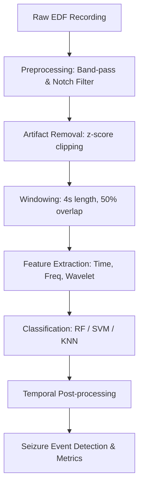

# EEG-Based Brain State and Seizure Detection System


A MATLAB framework for processing scalp EEG recordings and detecting epileptic seizures using classical machine learning. Built around the CHB-MIT Scalp EEG Database.

## Quick Start

```matlab
% 1. Set up paths and check toolboxes
setup_project

% 2. Run the single-patient demonstration
run_demo
```

`run_demo` will download a sample EDF file if it is not already present, extract features, train a Random Forest classifier, print evaluation metrics, and open the GUI.

**Note:** The single-patient demonstration verifies that the processing and prediction pipeline works correctly. Its metrics should not be interpreted as patient-independent performance.

## Pipeline & Features

### Processing Pipeline



### Key Features
- **Filtering:** Band-pass filtering (0.5 - 70 Hz), 60 Hz notch filter, z-score artifact clipping.
- **Feature Extraction:** 12 features per channel (variance, RMS, skewness, kurtosis, line length, 5 relative band powers, wavelet energy, wavelet entropy) using 4-second windows with 50% overlap.
- **Classification:** Random Forest, SVM, and KNN classifiers with configurable seizure-overlap labeling threshold.
- **Evaluation:** Temporal post-processing to suppress isolated false alarms, and Leave-one-patient-out (LOPO) cross-validation for patient-independent evaluation.
- **Visualization:** Interactive GUI with EEG waveform, spectrogram, band-power plot, and metrics panel.

## Dataset Details

This repository does **not** include the full CHB-MIT dataset (approximately 42 GB). A single recording (`chb01_03.edf`, ~32 MB) is downloaded automatically by the demo script for local verification.

The complete dataset can be obtained from PhysioNet:
https://physionet.org/content/chbmit/1.0.0/

### Full Dataset Experiment

To run leave-one-patient-out evaluation across multiple patients:

1. Download patient folders from PhysioNet (e.g. `chb01/`, `chb02/`, ...).
2. Place them in `data/raw/`.
3. Run:

```matlab
setup_project
run_full_experiment
```

*Patient-independent evaluation requires at least two patients. With only one patient installed, the system defaults to single-patient demonstration mode.*

## Requirements

- MATLAB R2020a or newer (tested on R2024b)
- Signal Processing Toolbox
- Statistics and Machine Learning Toolbox
- Wavelet Toolbox

## Configuration

All parameters are centralized in `config/project_config.m`:

| Parameter | Default | Description |
|-----------|---------|-------------|
| `fs` | 256 Hz | Sampling frequency |
| `filter_low` | 0.5 Hz | High-pass cutoff |
| `filter_high` | 70 Hz | Low-pass cutoff |
| `notch_freq` | 60 Hz | Notch filter frequency |
| `window_size_sec` | 4 s | Window length |
| `overlap_ratio` | 0.5 | Window overlap fraction |
| `seizure_overlap_threshold` | 0.5 | Minimum temporal overlap to label a window as seizure |
| `consecutive_windows` | 3 | Required consecutive positive predictions to trigger event |

## Project Structure

- **`app/`** - GUI application
- **`config/`** - Project configuration parameters
- **`data/`**
  - **`raw/`** - Raw EDF recordings (per patient)
  - **`processed/`** - Extracted feature matrices
- **`research/`** - Literature review and reference papers
- **`results/`**
  - **`models/`** - Saved classifier models
  - **`metrics/`** - Evaluation results
  - **`figures/`** - Generated plots
- **`scripts/`** - Executable scripts (setup, demo, full experiment, data loading)
- **`src/`**
  - **`data/`** - EDF loader, annotation parser
  - **`preprocessing/`** - Filtering, artifact removal
  - **`features/`** - Feature extraction, window labeling
  - **`models/`** - Classifier wrappers
  - **`detection/`** - Temporal post-processing
  - **`evaluation/`** - Metrics calculator, LOPO cross-validation
  - **`visualization/`** - Plotting utilities
- **`tests/`** - Unit tests for algorithms

## Limitations

- The included demo uses a single recording from one patient. This is sufficient to verify the pipeline but does not constitute a clinical evaluation.
- Full patient-independent performance requires downloading additional CHB-MIT data from PhysioNet.
- The system has been tested on CHB-MIT only. Other EEG formats or montages may require adaptation.

## Disclaimer

This software is intended for research and educational use only. It is not a clinically validated medical device and must not be used for diagnosis or treatment decisions.

## References

1. Shoeb, A. H. (2009). *Application of Machine Learning to Epileptic Seizure Onset Detection and Treatment*. PhD thesis, MIT.
2. Goldberger, A. L. et al. (2000). PhysioBank, PhysioToolkit, and PhysioNet: Components of a New Research Resource for Complex Physiologic Signals. *Circulation*, 101(23), e215-e220.
3. Boonyakitanont, P. et al. (2020). A review of feature extraction and performance evaluation in epileptic seizure detection using EEG. *Biomedical Signal Processing and Control*, 57, 101789.

## License

MIT License. See [LICENSE](LICENSE).
